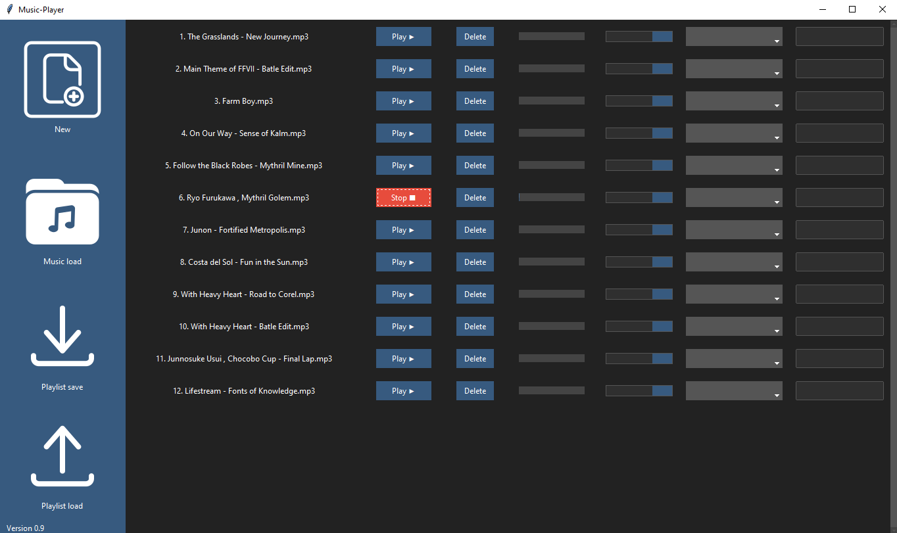

# Musik-Player

Ein einfacher Desktop-Musik-Player, gebaut mit Python, Tkinter und Pygame, der es ermöglicht, Musikdateien zu laden, abzuspielen und Playlisten zu verwalten.



## Funktionen

- Musikdateien laden und anzeigen
- Musikwiedergabe steuern (Play, Stop)
- Lautstärkeregelung
- Playlist speichern und laden
- Unterstützt gängige Audioformate wie MP3 und WAV

## Voraussetzungen

Um den Musik-Player zu verwenden, benötigst du Python und einige externe Bibliotheken. Stelle sicher, dass Python auf deinem System installiert ist. Die notwendigen Bibliotheken kannst du über pip installieren:

```bash
pip install pygame mutagen ttkthemes ttkbootstrap
```

## Starten des Musik-Players

1. Klone das Repository oder lade den Quellcode herunter.
2. Navigiere im Terminal oder Command Prompt zum Verzeichnis des Projekts.
3. Führe das Hauptskript aus

```bash
    python main.py
```

## Struktur des Projekts

- main.py: Enthält die Hauptlogik des Musik-Players.
- imports.py: Definiert die notwendigen Importe und Bibliotheken.
- /icons: Enthält Icons und Grafiken, die im UI verwendet werden.

## Erstellen einer Executable-Datei

- python -m PyInstaller: Mit diesem Befehl wird PyInstaller über den Python-Interpreter ausgeführt. Er weist Python an, das PyInstaller-Modul auszuführen.
- --onefile: Diese Option gibt an, dass die Ausgabe eine einzige ausführbare Datei sein soll. Standardmäßig erzeugt PyInstaller ein Verzeichnis mit mehreren Dateien, aber diese Option fasst sie in einer einzigen Datei zusammen.
- --noconsole: Diese Option legt fest, dass die erzeugte ausführbare Datei bei der Ausführung kein Konsolenfenster öffnen soll. Dies ist nützlich für GUI-Anwendungen, die keine Konsolenschnittstelle benötigen.
- --windowed: Diese Option legt fest, dass die erzeugte ausführbare Datei eine Fensteranwendung ohne Konsolenschnittstelle sein soll. Sie wird auch für GUI-Anwendungen verwendet.
- --add-data 'icons/;icons': Diese Option gibt zusätzliche Datendateien an, die in die ausführbare Datei aufgenommen werden sollen. In diesem Fall werden das Verzeichnis 'icons' und sein Inhalt aufgenommen und dem Verzeichnis 'icons' in der ausführbaren Datei zugeordnet.
- --add-data 'imports.py;.': Diese Option nimmt die Datei "imports.py" in die ausführbare Datei auf und ordnet sie dem Stammverzeichnis ('.') der ausführbaren Datei zu.
- main.py: Dies ist der Einstiegspunkt des Python-Skripts, das in eine ausführbare Datei umgewandelt wird. Ersetzen Sie "main.py" durch den tatsächlichen Namen Ihres Python-Skripts.

```bash
    python -m PyInstaller --onefile --noconsole --windowed --add-data 'icons/;icons' --add-data 'imports.py;.' main.py
```

## Mitwirken

Wir begrüßen Beiträge zu diesem Projekt! Wenn du einen Fehler findest oder eine Verbesserung vorschlagen möchtest, öffne bitte ein Issue oder sende einen Pull Request.

## Lizenz

Dieses Projekt ist unter der [GNU LICENSE](./LICENCE) lizenziert. Weitere Informationen finden Sie in der Lizenzdatei.