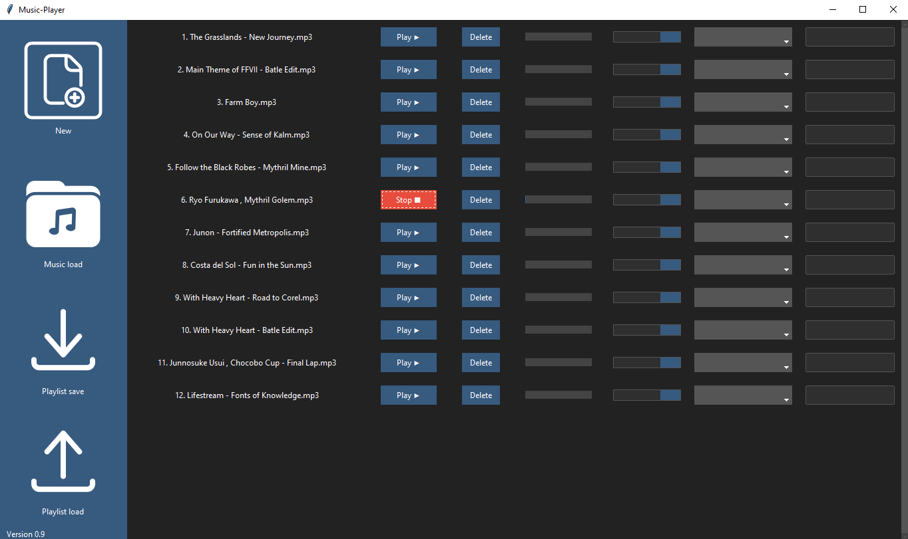

# MultiMusicPlayer

## Description

MultiMusicPlayer is a Python application that allows you to play multiple audio files simultaneously.



## Features

- Play multiple audio files at the same time
- Control playback (play, stop)
- Adjust volume for each audio file
- Seek to specific positions in the audio files
- Display the current playing status of each audio file

## Requirements

To use the music player, you need Python and some external libraries. Make sure that Python is installed on your system. You can install the necessary libraries via pip:

```bash
pip install pygame mutagen ttkthemes ttkbootstrap
```

## Start the music-player

1. clone the repository or download the source code.
2. navigate to the project directory in the terminal or command prompt.
3. execute the main script

```bash
    python main.py
```

## Struktur des Projekts

- main.py: Contains the main logic of the music player.
- imports.py: Defines the necessary imports and libraries.
- /icons: Contains icons and graphics that are used in the UI.

## Create an executable-Datei

- python -m PyInstaller: This is the command to run PyInstaller using the Python interpreter. It tells Python to execute the PyInstaller module.
- --onefile: This option specifies that the output should be a single executable file. By default, PyInstaller generates a directory with multiple files, but this option combines them into a single file.
- --noconsole: This option specifies that the generated executable should not open a console window when run. This is useful for GUI applications that don't require a console interface.
- --windowed: This option specifies that the generated executable should be a windowed application, without a console interface. It is also used for GUI applications.
- --add-data 'icons/;icons': This option specifies additional data files to be included in the executable. In this case, it includes the 'icons' directory and its contents, and maps it to the 'icons' directory in the executable.
- --add-data 'imports.py;.': This option includes the 'imports.py' file in the executable and maps it to the root directory ('.') of the executable.
- main.py: This is the entry point of the Python script that will be converted into an executable. Replace 'main.py' with the actual name of your Python script.

```bash
    python -m PyInstaller --onefile --noconsole --windowed --add-data 'icons/;icons' --add-data 'imports.py;.' main.py
```

## Contributing

Contributions are welcome! If you have any ideas, suggestions, or bug reports, please open an issue or submit a pull request.

## License

This project is licensed under the MIT License. See the [LICENSE](LICENSE) file for more information.